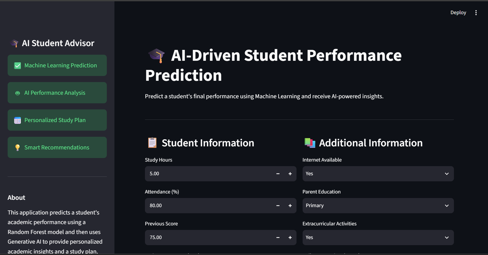
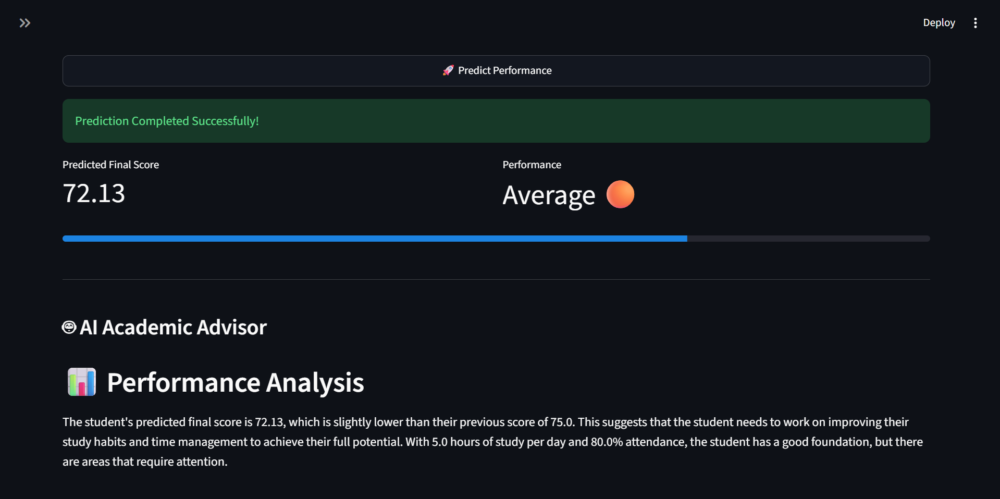
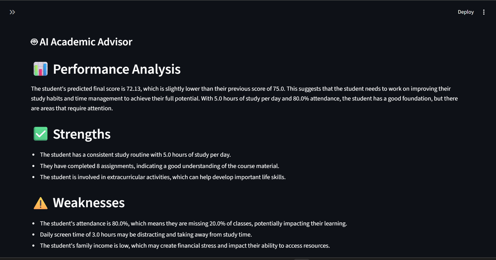
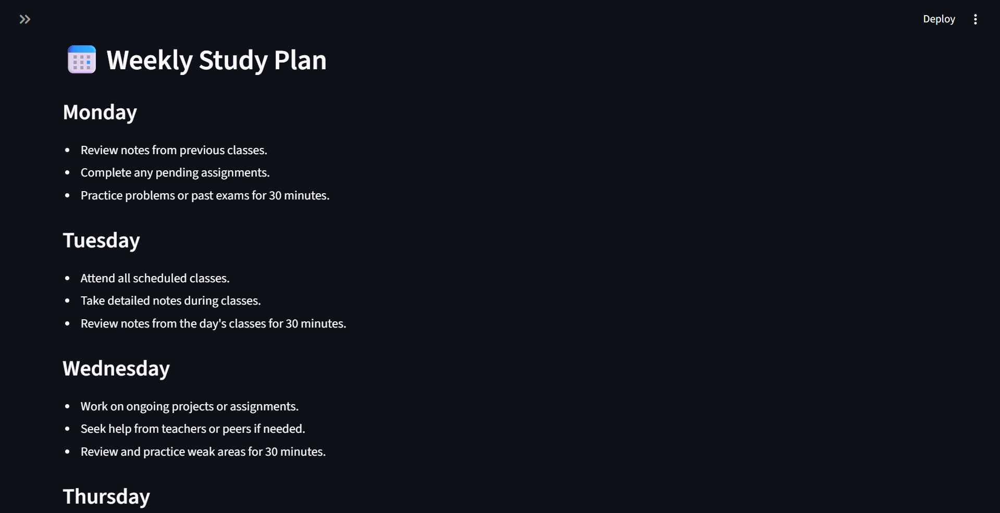

# 🎓 AI-Driven Student Performance Prediction

An AI-powered web application that predicts a student's final academic performance using Machine Learning and provides personalized academic insights, recommendations, and a weekly study plan using Generative AI.

---

## 📌 Project Overview

Student performance depends on multiple academic and personal factors. This project combines **Machine Learning** and **Generative AI** to help students understand their predicted performance and receive personalized guidance.

The application:

- Predicts a student's final score using a **Random Forest Regressor**
- Classifies the predicted performance level
- Generates AI-powered academic analysis
- Suggests personalized recommendations
- Creates a weekly study plan
- Motivates students with personalized feedback

---

## 🚀 Features

### 📊 Machine Learning

- Student performance prediction using Random Forest Regressor
- Data preprocessing and feature encoding
- Model evaluation using MAE and R² Score
- Trained model saved using Joblib

### 🤖 AI Academic Advisor

- Performance analysis
- Student strengths
- Areas for improvement
- Personalized recommendations
- Weekly study plan
- Motivational feedback

### 💻 Interactive Web Application

- Clean Streamlit interface
- Real-time prediction
- Performance indicator
- Progress bar visualization
- Error handling for AI responses

---

## 🛠️ Tech Stack

- Python
- Streamlit
- Pandas
- NumPy
- Scikit-learn
- Joblib
- Groq API
- Llama 3.3 70B Versatile
- Python-dotenv

---

## 📂 Project Structure

```
AI-Driven-Student-Performance-Prediction/
│
├── dataset/
│   └── student-dataset.csv
│
├── app.py
├── ai_helper.py
├── train_model.py
├── model.pkl
├── requirements.txt
├── .env
├── .gitignore
└── README.md
```

---

## 📊 Dataset Features

| Feature | Description |
|----------|-------------|
| StudyHours | Daily study hours |
| Attendance | Attendance percentage |
| PreviousScore | Previous examination score |
| Assignments | Assignments completed |
| InternetAvailable | Internet access |
| ParentEducation | Parent's education level |
| SleepHours | Daily sleep hours |
| ExtracurricularActivities | Participation in extracurricular activities |
| DailyScreenTime | Daily screen time |
| FamilyIncome | Family income level |
| FinalScore | Target variable |

---

## ⚙️ Installation

### 1. Clone the repository

```bash
git clone https://github.com/uttamkumar7235/AI-Driven-Student-Performance-Prediction.git
```

### 2. Navigate to the project

```bash
cd AI-Driven-Student-Performance-Prediction
```

### 3. Install dependencies

```bash
pip install -r requirements.txt
```

### 4. Create a `.env` file

Add your Groq API key:

```env
GROQ_API_KEY=your_api_key_here
```

---

## ▶️ Train the Machine Learning Model

Run:

```bash
python train_model.py
```

The script will:

- Load the dataset
- Preprocess the data
- Train the Random Forest model
- Evaluate model performance
- Save the trained model as `model.pkl`

---

## 🚀 Run the Application

Start the Streamlit app:

```bash
streamlit run app.py
```

Then open your browser and interact with the application.

---

## 📸 Application Screenshots

<p align="center">
  
  
</p>

<p align="center">
  
  
</p>

---

## 📷 Application Workflow

1. Enter student details.
2. Click **Predict Performance**.
3. View the predicted final score.
4. Check the predicted performance category.
5. Receive AI-generated:
   - Performance analysis
   - Strengths
   - Weaknesses
   - Personalized recommendations
   - Weekly study plan
   - Motivation

---

## 📈 Model Evaluation

The Random Forest model is evaluated using:

- Mean Absolute Error (MAE)
- R² Score

These metrics help measure the accuracy of the prediction model.

---

## 📦 Requirements

Install all required packages using:

```bash
pip install -r requirements.txt
```

Main libraries used:

- Streamlit
- Pandas
- NumPy
- Scikit-learn
- Joblib
- Groq
- Python-dotenv

---

## 🔮 Future Improvements

- Compare multiple Machine Learning algorithms
- Student performance analytics dashboard
- Batch prediction using CSV upload
- PDF report generation
- Performance history tracking
- Cloud deployment

---

## 👨‍💻 Author

**Uttam Kumar**

B.Tech Computer Science & Engineering

---

## ⭐ Support

If you found this project useful, please consider giving the repository a ⭐ on GitHub.